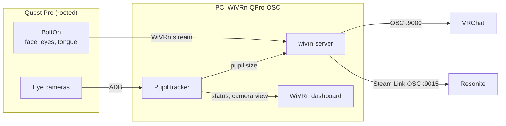
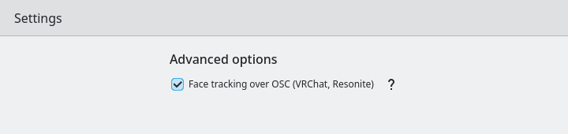
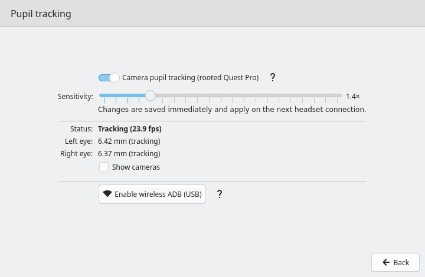

<h1 align="center"> WiVRn-QPro-OSC </h1>

<p align="center"><b>A fork of <a href="https://github.com/WiVRn/WiVRn">WiVRn</a> that sends Quest Pro face, eye, tongue and camera pupil tracking straight to VRChat and Resonite over OSC.</b></p>

One app: no VRCFaceTracking, no ALXR module, no Edrakon, nothing else to run on the PC. Start WiVRn, connect the headset and jump into VRChat or Resonite.

> [!IMPORTANT]
> This is an unofficial fork. Please report problems with the additions below **here**, not to the WiVRn project.
> Everything else is stock WiVRn 26.9, and its documentation (further down this page) applies.

## What this fork adds

| Feature | Where | Notes |
|---|---|---|
| **Face tracking over OSC (VRChat, Resonite)** | Dashboard → Settings → Advanced options | One switch for both games. Takes effect on the next headset connection. |
| VRChat | UDP `127.0.0.1:9000` | VRCFaceTracking v2 (Unified Expressions) avatar parameters, including binary (`Name1/2/4/8…`) and `Negative` parameters. The avatar's parameters are read from VRChat's OSCQuery, so only what the avatar uses is sent. VRChat's native eye tracking (`/tracking/eye/…`) is sent for avatars without their own eye parameters. |
| Resonite | UDP `127.0.0.1:9015` | Steam Link OSC (what Edrakon provides): face, tongue out and combined gaze. Sent only while Resonite runs and Edrakon does not. |
| **Pupil tracking** page | Dashboard → Pupil tracking | Camera-measured pupil size on a **rooted** Quest Pro, done by WiVRn itself: it starts the eye cameras on the headset over ADB, finds the pupils and learns each eye's bright-to-dark range while you play. Live status, per-eye values and camera view. Pupils go to VRChat (`PupilDilation`, `PupilDiameter…`). |
| Tongue | automatic | BoltOn's tongue layout ("TongueHack", FB face tracking 2 slots 63–67) is mapped to tongue out/left/right/up/down, so VRCFaceTracking's ALXR module setting is not needed. |

The headset app is **unchanged**: use the normal WiVRn 26.9 app (Meta Store, or the dashboard's install wizard).

### How it fits together



### Screenshots

<p align="center">
  <br>
  <i>Settings → Advanced options: one switch for VRChat and Resonite</i>
</p>

<p align="center">
  <br>
  <i>Pupil tracking page (rendered with sample values)</i>
</p>

## Headset side: BoltOn

Face, eye and tongue tracking come from [BoltOn](https://guides.mxr.lol/guides/bolton/) on a rooted Quest Pro. Follow its guide, then leave it in **VRCFT mode** (the default): BoltOn's Direct mode does not support WiVRn, and in VRCFT mode WiVRn receives BoltOn's data and this fork takes the place of VRCFaceTracking and the ALXR Local Module on the PC.

A stock (unrooted) Quest Pro also works for face and eye tracking through WiVRn, without tongue and without camera pupils.

## Install

### Arch Linux (and CachyOS, EndeavourOS, Manjaro…)

Builds `wivrn-server` and `wivrn-dashboard` 26.9 from this fork. They replace the AUR packages of the same name and version:

```sh
git clone https://github.com/Seventh-Void/WiVRn-QPro-OSC.git
cd WiVRn-QPro-OSC/archlinux
makepkg -si
```

To go back to stock WiVRn, reinstall the AUR packages (`wivrn-server`, `wivrn-dashboard`).

### Other distributions (build from source)

Install the build dependencies listed in [docs/building.md](docs/building.md), plus OpenCV (core, imgproc, imgcodecs), and `adb` (android-tools) for camera pupil tracking. Then:

```sh
git clone -b v26.9-qpro.1 https://github.com/Seventh-Void/WiVRn-QPro-OSC.git
cd WiVRn-QPro-OSC
cmake -B build -G Ninja -DGIT_TAG=v26.9 -DCMAKE_BUILD_TYPE=RelWithDebInfo -DCMAKE_INSTALL_PREFIX=/usr \
      -DWIVRN_BUILD_SERVER=ON -DWIVRN_BUILD_DASHBOARD=ON -DWIVRN_BUILD_CLIENT=OFF -DWIVRN_BUILD_WIVRNCTL=ON \
      -DWIVRN_OPENXR_MANIFEST_TYPE=relative
cmake --build build
sudo cmake --install build
```

`-DGIT_TAG=v26.9` keeps the version the same as upstream, so the dashboard installs the matching stock headset app.

The Flatpak is not supported.

## Set up

### VRChat and Resonite

1. Open the WiVRn dashboard → **Settings** → **Advanced options** → tick **Face tracking over OSC (VRChat, Resonite)** → **OK**.
2. Connect the headset (reconnect if it was already connected).
3. **VRChat:** enable OSC (Action menu → Options → OSC → Enabled) and use an avatar with VRCFaceTracking v2 parameters.
4. **Resonite:** install [ResoniteModLoader](https://github.com/resonite-modding-group/ResoniteModLoader) and [RemoveThatKinkFromSteamLinkCS](https://github.com/PointerOffset/RemoveThatKinkFromSteamLinkCS) (Resonite only listens for Steam Link face tracking with it), and close Edrakon.

To send to VRChat on another address, edit `~/.config/wivrn/config.json`:

```json
"vrchat-osc": { "host": "127.0.0.1", "port": 9000 }
```

### Camera pupil tracking (rooted Quest Pro)

1. Root access for ADB: in Magisk → Superuser, allow **Shell**.
2. Wireless ADB: plug the headset in over USB, open the dashboard → **Pupil tracking** → **Enable wireless ADB (USB)**, then unplug. Repeat after each headset reboot.
3. On the same page, turn on **Camera pupil tracking** and pick a sensitivity, then connect the headset (with face tracking over OSC on).

Values settle after a few minutes of play, as each eye's range is learned (bright scenes and dark scenes both help). Tick **Show cameras** to see what the eye cameras see.

### Ports used

| Port | Direction | Purpose |
|---|---|---|
| UDP 9000 | out | VRChat OSC |
| UDP 9015 | out | Resonite (Steam Link OSC) |
| TCP 27273 | local (ADB forward) | Eye camera stream from the headset |
| TCP 8081 | local | Pupil status and camera view for the dashboard |

## Credits and licenses

- [WiVRn](https://github.com/WiVRn/WiVRn) by Guillaume Meunier and contributors (GPL-3.0). This fork is GPL-3.0 as well.
- Expression mapping and parameter encoding follow [VRCFaceTracking](https://github.com/benaclejames/VRCFaceTracking) (Apache-2.0) and [VRCFT-ALXR-Modules](https://github.com/korejan/VRCFT-ALXR-Modules) (MIT).
- Steam Link OSC format: [LinkFT](https://github.com/ykeara/LinkFT)'s notes (MIT) and [danwillm's VRCFT-SteamLink](https://github.com/danwillm/VRCFT-SteamLink).
- The headset eye-camera helpers (`server/qpro_pupil/headset/`) and the pupil detector are from [Qpro-Enhanced-FT-Wireless](https://github.com/Fwooffy/Qpro-Enhanced-FT-Wireless), based on [Qpro-Enhanced-FT by n0tmast3r](https://github.com/n0tmast3r/Qpro-Enhanced-FT) (MIT, QproFaceTracking contributors).
- [BoltOn](https://guides.mxr.lol/guides/bolton/) by Walaryne provides the headset face tracking.

Not affiliated with or endorsed by WiVRn, Meta, VRChat, Resonite, VRCFaceTracking or BoltOn.

---

<p align="center"><i>The original WiVRn README follows.</i></p>

<h1 align="center"> WiVRn </h1>

<div align="center">
  
[](https://www.gnu.org/licenses/gpl-3.0)  
  
</div>
<p align="center"></p>
<h3 align="center">Fully FOSS PCVR streamer</h3>

# About

WiVRn is an application that wirelessly streams a virtual reality game to a standalone VR headset from a <b>Linux</b> computer.

WiVRn support a wide range of VR devices:

| Headset | Supported | Notes |
|:--------:|:--------:|:--------:|
| Quest 1 | ✓ |  |
| Quest 2 | ✓ |  |
| Quest 3 | ✓ |  |
| Quest 3s | ✓ |  |
| Quest Pro | ✓ |  |
| Pico Neo 3 | ✓ |  |
| Pico 4 | ✓ |  |
| HTC Vive Focus 3 | ✓ | Laggy | 
| HTC Vive XR Elite | ✓ | Laggy |
| Samsung Galaxy XR | ✓ |  |
| Other Android VR | ? | Cannot know |
| Play for Dream | ✖ | https://github.com/WiVRn/WiVRn/issues/465 |
| Non-Android VR | ✖ | Not Android |
| Non-VR Android | ✖ | VR required |

<sup>A Linux client does exist, only for debugging. It has no audio or hardware decoding.</sup>

# Getting started


## PC Server/Dashboard

We recommend using native packages if available for your distribution:
- [Arch User Repository](https://aur.archlinux.org/packages/wivrn-dashboard)
- [Fedora](https://packages.fedoraproject.org/pkgs/wivrn/wivrn/)
- [Gentoo Guru](https://gitweb.gentoo.org/repo/proj/guru.git/tree/media-libs/wivrn)
- [NixOS](https://search.nixos.org/packages?show=wivrn)

For OpenVR and Steam compatibility, you also need a compatibility library such as [xrizer](https://github.com/Supreeeme/xrizer/) or [OpenComposite](https://gitlab.com/znixian/OpenOVR/).

A Flatpak is available on Flathub for all distributions:

[](https://flathub.org/apps/io.github.wivrn.wivrn)

The Flatpak contains both xrizer and OpenComposite.

Note that due to Flatpak sandboxing, some features such as support for SteamVR tracked (Lighthouse) devices, or virtual gamepad/keyboard/input devices forwarded from the headset, may not be available.

## Headset Client/App

Follow the wizard in the PC dashboard to install the client on your VR headset.

It should either lead you to the [Meta Store](https://www.meta.com/experiences/7959676140827574/) (for Meta Quest headsets) or to download the correct APK (for other headsets).

> [!WARNING]
> The VR client and PC server need to be on the same version of WiVRn

> [!TIP]
> If the headset fails to connect to the computer, see [troubleshooting](#troubleshooting).


# Usage

## Running

### Prerequisites
Avahi must be running:
```bash
systemctl enable --now avahi-daemon
```

On SteamOS, the Avahi configuration needs to be modified to allow user services such as WiVRn to publish services on the network; see https://github.com/WiVRn/WiVRn/issues/1001#issuecomment-4940906113 for instructions on how to do so.

- If a firewall is installed, open port 5353/UDP for Avahi and ports 9757/UDP+TCP for WiVRn.
- For example, if using UFW run `ufw allow 5353/udp` and `ufw allow 9757`.

### Start the PC server process
The graphical frontend is listed as "WiVRn server" in the application list, and is `wivrn-dashboard` on command line. On first start, a wizard will guide you through the initial steps.

The actual server for headless usage is `wivrn-server`. When installed through your distribution's package manager, a systemd user service named `wivrn` is also installed, which can be enabled to automatically start on login with `systemctl --user enable --now wivrn`.

For Steam games, depending on the installation method, you may need to set launch options in the Steam properties for each game you want to run. Either the dashboard or command line output will display the launch command if it is required.

### Start the headset application
On the headset, when installed from the store, simply start `WiVRn`. If you installed the app via the dashboard, or manually via `adb`, it will be in an "unknown sources" section.

On first start, it will ask if you want to enable some features such as microphone, hand tracking, eye tracking, etc., as they will require permissions to be granted. It is possible to grant those later from the Settings tab.

It is highly recommended to use default settings and only tweak them if you experience issues.

### Connect to the server
The headset application will start on a server list. Your computer should be visible and have a connect button. Simply click it to start streaming.

When the headset is connected, wivrn-server sets the OpenXR and OpenVR configuration to use WiVRn. Thus, applications will only be able to run in VR once the headset connection is established. The configuration is reverted once the connection ends and all running VR applications are closed. 

The headset connection also triggers the creation of a virtual speaker and, if enabled in the headset app settings, a microphone. You will have to set them as the default output and input devices in your system audio configuration. This setting persists to future sessions until you change the defaults to other devices.

### Start an application
When the headset is connected and no XR application is running, it will show an application launcher. Applications in that list are sourced from:
- Steam games that are flagged as VR. Steam may need to be restarted for the list to be updated when new games are installed.
- .desktop files that contain `X-WiVRn-VR` in the `Categories` section. Files are searched in [standard locations](https://specifications.freedesktop.org/desktop-entry/latest/file-naming.html#desktop-file-id) which usually include `~/.local/share/applications` and `/usr/share/applications/`.

You can set an application to be started automatically when your headset is connected, in the dashboard settings or [manually](docs/configuration.md#application).

## Steam Flatpak
Flatpak applications are only able to access the Flatpak version of WiVRn.

If you're using the Steam Flatpak, you'll need to grant read only access to the following paths:

```bash
flatpak override \
  --filesystem=xdg-run/wivrn:ro \
  --filesystem=xdg-data/flatpak/app/io.github.wivrn.wivrn:ro \
  --filesystem=/var/lib/flatpak/app/io.github.wivrn.wivrn:ro \
  --filesystem=xdg-config/openxr:ro \
  --filesystem=xdg-config/openvr:ro \
  com.valvesoftware.Steam
```

When using a user installation of flatpak Steam, use `override --user` instead of `override`.

The same overrides should work for other VR applications distributed as Flatpaks.

# Building

See [building](docs/building.md) for building the [dashboard](docs/building.md#dashboard), [server (PC)](docs/building.md#server-pc), and [client (headset)](docs/building.md#client-headset)


# Configuration
Most settings are controlled through the headset app, while the server has configuration for items that are specific to the server. Use the dashboard to edit the latter, or see [configuration](docs/configuration.md) for editing it manually.

# Troubleshooting
<details><summary>My computer is not seen by the headset</summary>

If the server list is empty in the headset app:
- Make sure your computer is connected on the same network as your headset
- Check that avahi is running with `systemctl status avahi-daemon`, if it is not, enable it with `systemctl enable --now avahi-daemon`
- If you have a firewall, check that port 5353 (UDP) is open</details>

<details><summary>My headset does not connect to my computer</summary>
  
- If you have a firewall, check that port 9757 (UDP and TCP) is open
- The server and client must be the same version.</details>

<details><summary>How do I use a wired connection manually?</summary>

- Make sure the WiVRn Server is installed and running on your computer
- Make sure you have the WiVRn app installed on your headset
- After starting the "WiVRn Server" on your computer and ensuring your device is connected to your PC via cable, run the following in your terminal (Note: using `adb` on some devices may require developer mode to be enabled):
   - ```bash
      adb reverse tcp:9757 tcp:9757
      adb shell am start -a android.intent.action.VIEW -d "wivrn+tcp://localhost" org.meumeu.wivrn
      ```
   - Depending on your install type, you may need to replace `org.meumeu.wivrn` (Meta Store install) with:
      - `org.meumeu.wivrn.github` for [releases](https://github.com/WiVRn/WiVRn/releases) on Github
      - `org.meumeu.wivrn.github.nighly` for Github nightlies (wirvn-apk [repository](https://github.com/WiVRn/WiVRn-APK/releases))
      - `org.meumeu.wivrn.github.testing` for Github CI builds
      - `org.meumeu.wivrn.local` for developer builds
- You can now continue the pairing process as documented in the running section.</details>

<details><summary>How do I see server logs when using the dashboard?</summary>

- Click **Troubleshoot > Open server logs**
- Or, navigate to `${XDG_STATE_HOME}/wivrn/wivrn-dashboard`
  - In other words, on common setups, the dashboard writes logs to `~/.local/state/wivrn/wivrn-dashboard`
  - For WiVRn Flatpak, the dashboard writes logs to `~/.var/app/io.github.wivrn.wivrn/.local/state/wivrn/wivrn-dashboard`</details>

<details><summary>My NVIDIA GPU P-State is limited to P2 instead of reaching the highest P0 while using the NVIDIA NVENC encoder</summary>
    
- See [nvenc](docs/nvenc.md) for troubleshooting.</details>

<details><summary>I have high motion latency, black borders following my view, hear corrupted audio or see a corrupted, pixelated image</summary>

- When connecting through USB, make sure the headset isn't connected through WiFi (switch off WiFi)
- Reset the settings using the button at the bottom of the settings tab
- Try switching to software encoding
- Decrease the bitrate
- Decrease the resolution in the WiVRn app
- Connect through USB or use a better WiFi router.

Note: WiVRn isn't properly optimized for NVIDIA GPUs due to the lack of developers with NVIDIA hardware. Motion latency may be significantly worse at rendering resolutions higher than default.</details>

# Community Support

We are available on either **Discord** or **Matrix space**:

[](https://discord.gg/EHAYe3tTYa) [](https://matrix.to/#/#linux-vr-adventures:matrix.org)

Please use the `wivrn` chat room for questions or issues specific to WiVRn.


# Contributing

## Translations

See [translating](docs/translating.md) for procedure.


# Credits
WiVRn uses the following software:
- [ambientCG](https://ambientcg.com/)
- [Avahi](https://www.avahi.org/)
- [Boost.Locale](https://github.com/boostorg/locale)
- [Boost.PFR](https://github.com/boostorg/pfr)
- [CLI11](https://github.com/CLIUtils/CLI11)
- [Dear ImGui](https://github.com/ocornut/imgui)
- [fastgltf](https://github.com/spnda/fastgltf)
- [ffmpeg](https://ffmpeg.org/) optional, for hardware encoding on AMD/Intel
- [FreeType](https://freetype.org/)
- [glm](http://glm.g-truc.net/)
- [HarfBuzz](https://harfbuzz.github.io/)
- [librsvg](https://wiki.gnome.org/Projects/LibRsvg)
- [Monado](https://monado.freedesktop.org/)
- [nvenc](https://developer.nvidia.com/nvidia-video-codec-sdk) optional, for hardware encoding on NVIDIA
- [qCoro](https://qcoro.dev/)
- [Qt 6](https://www.qt.io/) optional, for the dashboard
- [spdlog](https://github.com/gabime/spdlog)
- [VulkanMemoryAllocator](https://github.com/GPUOpen-LibrariesAndSDKs/VulkanMemoryAllocator)
- [WebXR input profiles](https://www.npmjs.com/package/@webxr-input-profiles/motion-controllers)
- [x264](https://www.videolan.org/developers/x264.html) optional, for software encoding
