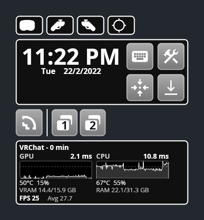

# fpsVR-style stats on the WayVR watch

A frame timing panel for [WayVR](https://github.com/wlx-team/wayvr)'s wrist watch, like fpsVR on SteamVR: per-frame CPU and GPU frame time graphs for the VR app you're in, plus FPS, temperatures, load and memory.

<p align="center"></p>

*The watch rendered with WayVR's `uidev` previewer. The panel values and graphs were captured from VRChat running on this fork. The clock, date and missing battery levels are the previewer's placeholders, and the dark background stands in for the game behind the watch.*

## What it shows

| Item | Source |
|---|---|
| App name and time in it | WiVRn: the focused (non-overlay) OpenXR app. Time counts from when the panel first saw it in focus (restarting the panel restarts it). |
| GPU / CPU frame time and graphs | WiVRn, every frame of the focused app. CPU = app wake-up to `xrEndFrame`, GPU = `xrEndFrame` to its GPU work finishing. Graphs show the last 150 frames; the dashed line is the frame budget for the headset's refresh rate. Frame time labels are the average over the last second. |
| FPS | Frames the app delivered in the last second. Shows `--` until a full second has passed. |
| Avg | Frames delivered since the panel first saw the app in focus, divided by the time since then. |
| GPU temperature and load | `amdgpu`: junction (hotspot) temperature and `gpu_busy_percent`. |
| VRAM | `amdgpu`: `mem_info_vram_used` / `mem_info_vram_total`. |
| CPU temperature and load | `k10temp` (Tctl) or `coretemp` (package) temperature; load from `/proc/stat`. |
| RAM | `/proc/meminfo`: total minus available. |

Nothing is estimated. Anything this machine can't read stays `--` (GPU stats need an AMD GPU; the CPU temperature is left out without `k10temp` or `coretemp`).

The overlay itself (WayVR) is never counted: WiVRn only exports the focused app.

## Requirements

- `wivrn-server` from this fork, **v26.9-qpro.3 or later** (it writes `/dev/shm/wivrn-frametime`). Stock WiVRn doesn't export frame times; the panel then only shows the hardware stats.
- WayVR 26.8 with `wayvrctl` (included in the `wayvr` package).
- Python 3 (standard library only) and a systemd user session.

## Install

From this folder:

```sh
install -Dm755 wayvr-stats ~/.local/bin/wayvr-stats
install -Dm644 -t ~/.config/systemd/user wayvr-stats.path wayvr-stats.service
systemctl --user daemon-reload
systemctl --user enable --now wayvr-stats.path

# The watch layout. This replaces your watch, so back up an existing one first.
install -Dm644 watch.xml ~/.config/wayvr/theme/gui/watch.xml
```

Then restart WayVR (`wayvr --replace`, or close and start it). The stats start by themselves whenever WayVR starts, however it is launched.

### Already have a custom watch?

Copy two parts of `watch.xml` into yours instead of replacing it:

1. The `StatColumn` template (next to the other `<template>` tags).
2. The `<rectangle>` marked `fpsVR-style stats`, inside the main container below the bottom button row.

`StatColumn` uses the `~color_text`, `~color_faded` and `~color_accent_40` theme variables and the `decorative_rect` macro from this watch; define them or swap in your own.

## Colours

The watch colours are the theme variables at the top of `watch.xml` (white by default). The graph colour is set separately:

```sh
systemctl --user edit wayvr-stats.service
```

```ini
[Service]
Environment=WAYVR_STATS_COLOR=#A855F7
```

## How it works

`wivrn-server` writes each frame's CPU and GPU time for the focused app into a ring buffer at `/dev/shm/wivrn-frametime` (layout documented in [`server/driver/app_pacer.cpp`](../../server/driver/app_pacer.cpp)). `wayvr-stats` reads it 15 times a second, draws the graphs as small SVG files in `$XDG_RUNTIME_DIR` and sends them and the labels to the watch through one `wayvrctl batch` connection. Labels are only resent when they change.

`wayvr-stats.path` starts the script whenever WayVR writes `$XDG_RUNTIME_DIR/wayvr.pid` (on every start). The script exits when that WayVR exits.
